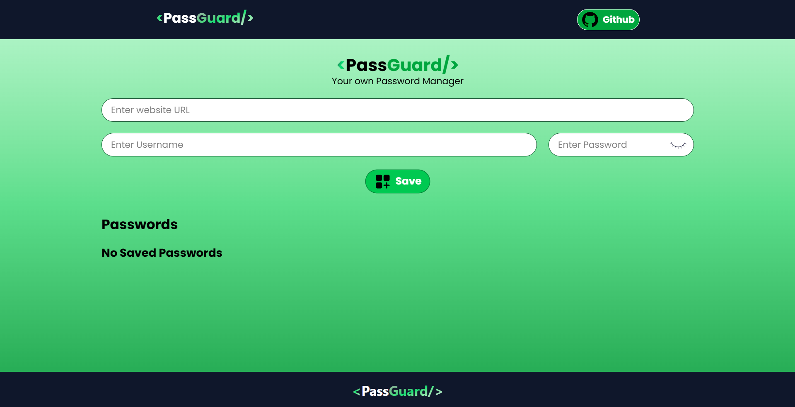

# 🚀 PassGuard - [Live Demo(Click Me)](https://pass-guard-umber.vercel.app/)

## 🔐 Your Personal Fortress for Password Security

Welcome to **PassGuard**, the ultimate solution for managing your passwords with ease and security. Crafted meticulously by [@TheRealFarhanDev](https://github.com/TheRealFarhanDev), PassGuard ensures that your credentials are stored safely, giving you peace of mind in the digital world.

---

## 🌟 Features

- **Secure Storage**: Safeguard your passwords using robust encryption techniques.
- **User-Friendly Interface**: Navigate effortlessly through a clean and intuitive UI.
- **Cross-Platform Compatibility**: Access your passwords seamlessly across various devices.
- **Offline Access**: Retrieve your credentials even without an internet connection.
- **Open Source**: Contribute and customize as per your requirements.

---

## 🛠️ Technologies Used

- **Frontend**: HTML, CSS, JavaScript
- **Backend**: Node.js, Express
- **Database**: MongoDB
- **Version Control**: Git & GitHub

---

## 📸 Screenshot



---

*Manage all your credentials in one place.*

---

## 🚀 Getting Started

1. **Clone the repository**:
   ```bash
   git clone https://github.com/TheRealFarhanDev/PassGuard.git
   ```
2. **Navigate to the project directory**:
   ```bash
   cd PassGuard
   ```
3. **Install dependencies**:
   ```bash
   npm install
   ```
4. **Start the application**:
   ```bash
   npm start
   ```

---

## 🤝 Contributing

Contributions are what make the open-source community such an amazing place to learn, inspire, and create. Any contributions you make are **greatly appreciated**.

1. Fork the Project
2. Create your Feature Branch (`git checkout -b feature/AmazingFeature`)
3. Commit your Changes (`git commit -m 'Add some AmazingFeature'`)
4. Push to the Branch (`git push origin feature/AmazingFeature`)
5. Open a Pull Request

---

## 🙌 Acknowledgements

This project is developed and maintained by [@TheRealFarhanDev](https://github.com/TheRealFarhanDev).
